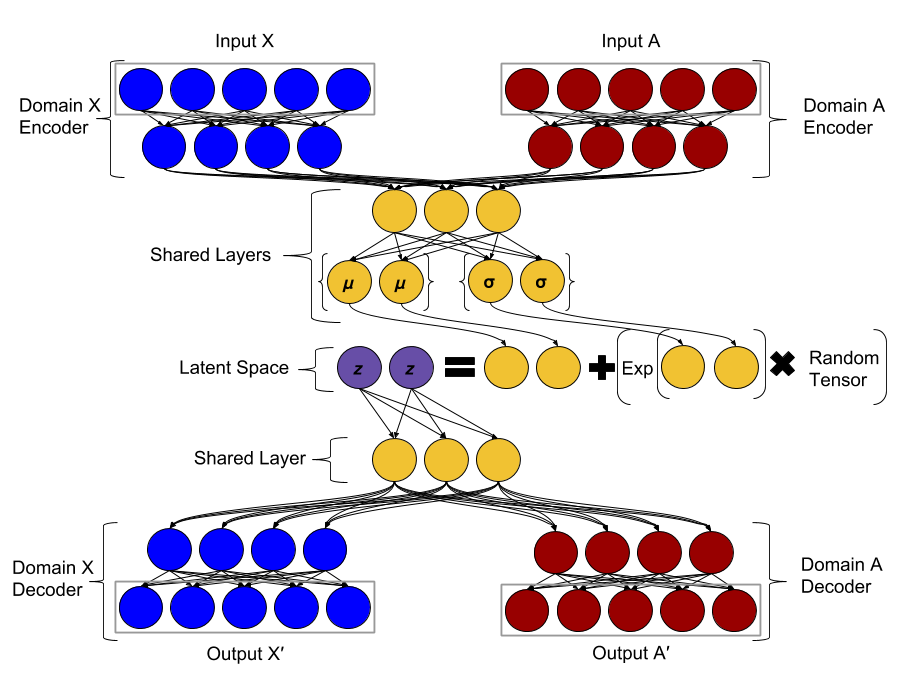

# The Motivation of Shared Latent Space Variational Auto Encoders
## In Biology
Shared Latent Space VAE's find relationships between two different domains and allow for transformations between the two. This has especially useful implications in biology, where you may be able to have predictions of how certain tests will look based on ones you already possess. 


# Diagram of Model



# Files

### main_file.py
This is the file which should be called. It handles calling other files for loading and formating data. It also calls upon shared_vae_class.py to create the model, train it, and generate data. As work continues, this file will become more general and easier to work with. As of now, if you are using your own data, you should create a file for it which impliments the DataSetInfoAbstract abtract class. Then create it in the file and the file should know how to interact with it.

To run the file, open command line and enter:
```
python main_file.py
```

### shared_vae_class.py
This file is the main class which hold the model. It contains functions to compile, train, and generate from the model. The model will take in a series of parameters which control size of layers, etc. The model right now is very rigid in structure, but this may change. There a 5 different models built inside here for the purposes of training, but they are hidden. The generate function calls on the visualize function of the DataSetInfoAbstract class. This will produce an image to help visualize how the model is working.

### model_objects.py
This file contains the model_parameters class which is fed to the shared_vae_class when it is initialized.

### DataSetInfoAbstractClass.py
This file is an abstract class which is used for any dataset specific functions such as loading and visualizing. These are abstract functions, so a specific implimentation must be provided for the dataset.

### ICVL.py
This is a specific implimentation of the DataSetInfoAbstract abstract class for the ICVL data. It contains a load function which loads the data from a pickle file as well as a visualize function which produces images of the depth maps and knuckle maps. The draw_hands function draws all of the lines between the joints in the hand as given by the dataset. 

### MNIST.py
This is a specific implimentation of the DataSetInfoAbstract abstract class for the MNIST data. It contains a load function which loads the data from a pickle file as well as a visualize function which produces images of the regular MNIST digits and the inverse MNIST digits.

# Usage
## Computational Environment
All libraries and packages are handled by conda and specified in the `enviroment.yml` file. To build and activate this enviroment, run:
```
#conda version 4.4.10
conda env create --force --file enviroment.yml

conda activate shared-latenet-space
```

## Running the Model
The pickle files for MNIST and ICVL are both too big to include on the repo. They are publically available and I will later provide an easy way to download them that will be consistent among platforms. You should consider changing the layout of the model, which is controlled in the intialization of the model_parameters object in main_file.py. You can also control the noise leve as a parameter to the train function also located inside main_file.py.

## Changing Datasets
If the data set is one of the already included datasets, you need to change which implementation of DataSetInfoAbstract is called when defining the DataSetInfo object. Additionally, you should consider changing the model layout, as outlined in Running the Model.

## Adding More Datasets
If you want to add more Datasets, that is fully supported. Create your own implementation of the DataSetInfoAbstract abstract class including a method for loading and visualizing. You must return two training sets and two testing sets. You do not have to return anything for visualization, so it is merely sufficent to define the function and return nothing. Thus, you don't need to implement a visualization, but you must declare it to comply with the interface. 
